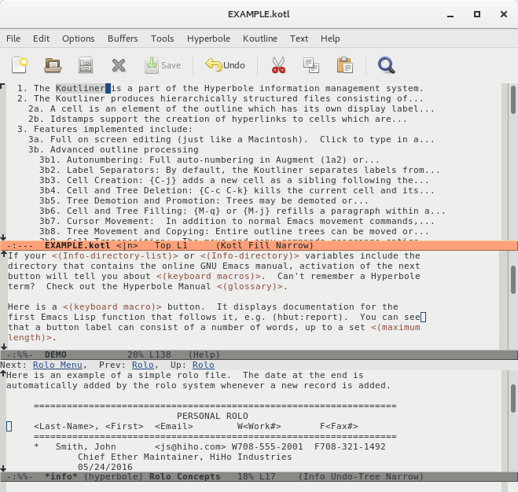
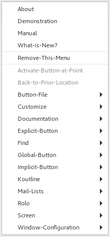
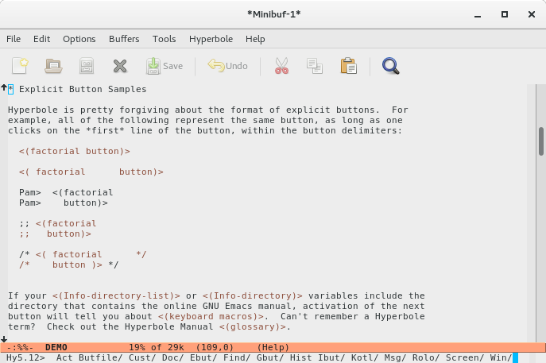
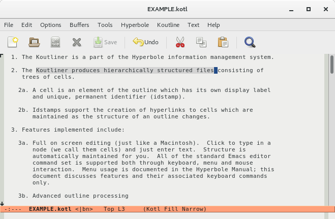
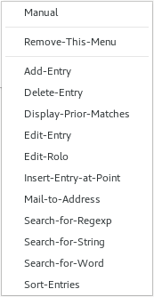

# GNU Hyperbole 6.0.2d - The Everyday Hypertextual Information Manager

<!-- START doctoc generated TOC -->
**Table of Contents**

- [Summary](#summary)
- [Mailing Lists](#mailing-lists)
- [Ftp and Git Source Code-only Downloads](#ftp-and-git)
- [Installation](#installation)
- [Invocation](#invocation)
- [Hyperbole Components](#hyperbole-components)
- [Hyperbole Buttons](#hyperbole-buttons)
- [Important Features](#important-features)
- [Hyperbole Uses](#hyperbole-uses)
- [Files](#files)
- [Programmer Quick Reference](#programmer-quick-reference)
- [User Quotes](#user-quotes)
- [Why was Hyperbole developed?](#why-was-hyperbole-developed)

<!-- END doctoc generated TOC -->

## Summary

`GNU Hyperbole` (pronounced Ga-new Hi-per-bo-lee), or just `Hyperbole`,
is an easy-to-use, yet powerful and programmable hypertextual information
management system implemented as a GNU Emacs package.  It offers rapid views
and interlinking of all kinds of textual information, utilizing Emacs for
editing.  It can dramatically increase your productivity and greatly reduce
the number of keyboard/mouse keys you'll need to work efficiently.

Hyperbole lets you:

   1. Quickly create hyperlink buttons either from the keyboard or by dragging
      between a source and destination window with a mouse button depressed.
      Later activate buttons by pressing/clicking on them or by giving the
      name of the button.

   2. Activate many kinds of `implicit buttons` recognized by context
      within text buffers, e.g. URLs, grep output lines, and git commits.
      A single key or mouse button automatically does the right thing in
      dozens of contexts; just press and go.

   3. Build outlines with multi-level numbered outline nodes, e.g. 1.4.8.6,
      that all renumber automatically as any node or tree is moved in the
      outline.  Each node also has a permanent hyperlink anchor that you can
      reference from any other node;

   4. Manage all your contacts quickly with hierarchical categories and
	  embed hyperlinks within each entry.  Or create an archive of documents
	  with hierarchical entries and use the same search mechanism to quickly
      find any matching entry;

   5. Use single keys to easily manage your Emacs windows or frames and
      quickly retrieve saved window and frame configurations;

   6. Search for things in your current buffers, in a directory tree or
	  across major web search engines with the touch of a few keys.

The common thread in all these features is making retrieval,
management and display of information fast and easy.  That is
Hyperbole's purpose.  It may be broad but it works amazingly well.  If
it is textual information, Hyperbole can work with it.  In contrast to
Org mode, Hyperbole works across all Emacs modes and speeds your work
by turning all kinds of references into clickable hyperlinks and
allowing you to create new hyperlinks by dragging between two windows.
The [Hyperbole wiki page](https://www.emacswiki.org/emacs/Hyperbole)
explains the many ways it differs from and is complementary to Org
mode.

Hyperbole allows hypertext buttons to be embedded within unstructured
and structured files, mail messages and news articles.  It offers
intuitive keyboard and mouse-based control of information display
within multiple windows.  It also provides point-and-click access to
World-Wide Web URLs, Info manuals, ftp archives, etc.

Hyperbole includes easy-to-use, powerful hypertextual button types
without the need to learn a markup language.  Hyperbole's button types
are written in Lisp and can be wholly independent of the web, i.e. web
links are one type of Hyperbole link, not fundamental to its link
architecture.  However, Hyperbole is a great assistant when editing
HTML or Javascript or when browsing web pages and links.

Hyperbole is something to be experienced and interacted with, not
understood from reading alone.  If you like an Emacs package to do
only one thing than Hyperbole is not for you, but if you would
rather learn fewer packages and get more work done faster, then
Hyperbole is for you.

Hyperbole works well on GNU Emacs 24.4 or above.  It is designed and
written by Bob Weiner.  It is maintained by him and Mats Lidell.  Its
main distribution site is: <https://www.gnu.org/software/hyperbole/>.
If any term in here is new or unfamiliar to you, you can look it up in the
[Hyperbole Glossary](man/hyperbole.html#Glossary).

Hyperbole is available for [download and installation](#installation)
through the GNU Emacs package manager.

## Mailing Lists

   - **hyperbole-users@gnu.org** - User list for GNU Hyperbole

       [info and subscription]: http://lists.gnu.org/mailman/listinfo/hyperbole-users
       [web archive]: http://lists.gnu.org/pipermail/hyperbole-users/

   - **bug-hyperbole@gnu.org** - List for bug reporting

       [info and subscription]: http://lists.gnu.org/mailman/listinfo/bug-hyperbole
       [web archive]: http://lists.gnu.org/archive/html/bug-hyperbole/

## Ftp and Git Source Code-only Downloads

To explore the released Hyperbole source code rather than installing it for use,
download a tar.gz source archive from either:

   - ftp://ftp.gnu.org/gnu/hyperbole/

   - http://ftpmirror.gnu.org/hyperbole/

which will find the closest mirror of the GNU ftp site and show it to you.

If you want to follow along with Hyperbole development and maintain a
copy/clone of the current version-controlled git tree, use the
[command listed here](https://savannah.gnu.org/git/?group=hyperbole)
to clone the Hyperbole project tree.

## Installation

Once you have Emacs set up at your site, GNU Hyperbole may be
installed by using the Emacs Package Manager.  If you are not
familiar with it, see the Packages section of the GNU Emacs Manual,
[Emacs Packages](https://www.gnu.org/software/emacs/manual/html_node/emacs/Packages.html). 

If you have Hyperbole 5.10 or higher already installed and simply want to
upgrade it, invoke the Emacs Package Manager with {M-x list-packages RET},
then use the {U} key followed by the {x} key to upgrade all out-of-date
packages, Hyperbole among them.  Then skip the text below and move on to
the next section, [Invocation](#invocation).

Otherwise, to download and install the Hyperbole package, you should
add several lines to your personal Emacs initialization file,
typically "~/.emacs".  For further details, see [Emacs Init
File](https://www.gnu.org/software/emacs/manual/html_node/emacs/Init-File.html).

Below are the lines to add:

    (require 'package)
    (setq package-enable-at-startup nil) ;; Prevent double loading of libraries
    (package-initialize)
    (unless (package-installed-p 'hyperbole)
      (package-refresh-contents)
      (package-install 'hyperbole))
    (require 'hyperbole)

----

Now save the file and then restart Emacs.  Hyperbole will then be
downloaded and compiled for use with your version of Emacs; give it a
minute or two.  You may see a bunch of compilation warnings but these
can be safely ignored.

## Invocation

Once Hyperbole has been installed for use at your site and loaded into your
Emacs session, it is ready for use.  You will see a Hyperbole menu on your
menubar and {C-h h} will display a Hyperbole menu in the minibuffer for
quick keyboard-based selection.

You can invoke Hyperbole commands in one of three ways:

   use the Hyperbole menu on your menubar;

   

   type {C-h h} or {M-x hyperbole RET} to bring up the Hyperbole main menu
   in the minibuffer window, for fast keyboard or mouse-based selection;
   select an item from this menu by typing the item's first letter; use {q}
   to quit from the menu.

   use a specific Hyperbole command such as an Action Key click {M-RET} on
   a pathname to display the associated file or directory.

Use {C-h h d d} for an interactive demonstration of standard Hyperbole
button capabilities.

{C-h h k e} offers a interactive demonstration of the Koutliner,
Hyperbole's multi-level autonumbered hypertextual outliner.

To try out HyControl, Hyperbole's interactive frame and window control
system, use {C-h h s w} for window control or {C-h h s f} for frame
control.  {t} switches between window and frame control once in one of
them.  Hyperbole also binds {C-c \} for quick access to HyControl's
window control menu if it was not already bound prior to Hyperbole's
initialization.  A long video demonstrating most of HyControl's
features is available at https://youtu.be/M3-aMh1ccJk.

The above are the best interactive ways to learn about Hyperbole.
Hyperbole also includes the Hyperbole Manual, a full reference manual,
not a simple introduction.  It is included in the "man/" subdirectory
of the Hyperbole package directory in four forms:

[hyperbole.info](man/hyperbole.info)   - online Info browser version  
[hyperbole.html](man/hyperbole.html)   - web HTML version  
[hyperbole.pdf](man/hyperbole.pdf)     - printable version  
[hyperbole.texi](man/hyperbole.texi)   - source form  

The Hyperbole package installation places the Info version of this manual
where needed and adds an entry for Hyperbole into the Info directory under
the Emacs category.  {C-h h d i} will let you browse the manual.  For web
browsing, point your browser at "${hyperb:dir}/man/hyperbole.html",
wherever the Hyperbole package directory is on your system; often this is:
"~/.emacs.d/elpa/hyperbole-${hyperb:version}/".

## Hyperbole Components

Hyperbole consists of five parts:

   1.  **Buttons and Smart Keys**: A set of hyperbutton types which supply
       core hypertext and other behaviors.  Buttons may be added to
       documents (explicit buttons) with a simple drag between windows,
       no markup language needed.  Implicit buttons are patterns
       automatically recognized within text that perform actions,
       e.g. bug#24568 displays the bug status information for that bug
       number.
       
       These actions may be links or arbitrary Lisp expressions.  So
       for example, you could create your own button type of
       Wikipedia searches that jumped to the named Wikipedia page
       whenever point was within text of the form [wp<search term>].
       You define the pattern so {<search term>} might do the same
       thing if you preferred.  And this works within any Emacs
       buffer you want it to, regardless of major or minor mode.

       Buttons are accessed by clicking on them or referenced by name
       (global buttons), so they can be activated regardless of what is
       on screen.  Users can make simple changes to button types and
       those familiar with Emacs Lisp can prototype and deliver new
       types quickly with just a few lines of code.

       Hyperbole includes two special `Smart Keys', the Action Key
       and the Assist Key, that perform an extensive array of
       context-sensitive operations across emacs usage, including
       activating and showing help for Hyperbole buttons.  In many
       popular Emacs modes, they allow you to perform common, sometimes
       complex operations without having to use a different key for each
       operation.  Just press a Smart Key and the right thing happens;

   2.  **Contact and Text Finder**: an interactive textual information
       management interface, including fast, flexible file and text
       finding commands.  A powerful, hierarchical contact manager,
       HyRolo, which anyone can use is also included.  It is easy to
       learn to use since it introduces only a few new mechanisms and
       has a menu interface, which may be operated from the keyboard or
       the mouse.

	   

   3.  **Screen Control**: Hyperbole includes HyControl, the fastest,
       easiest-to-use window and frame control available for GNU
       Emacs.  With just a few keystrokes, you can shift from
       increasing a window's height by 5 lines to moving a frame by
       220 pixels or immediately moving it to a screen corner.  Text
       in each window or frame may be enlarged or shrunk (zoomed) for
       easy viewing, plus many other features;

	   The broader vision for HyControl is to support persistent
   	   window and frame configurations as link targets.  Then a user
   	   will be able to create the views of information he wants and
   	   store them as links for rapid display.  Work remains to
   	   implement this feature but it helps explain the connection of
   	   HyControl to the rest of Hyperbole;

   4.  **The Koutliner**: an advanced outliner with multi-level
       autonumbering and permanent ids attached to each outline node for
       use as hypertext link anchors, per node properties and flexible
       view specifications that can be embedded within links or used
       interactively;

   5.  **Programming Library**: a set of programming library classes for
       system developers who want to integrate Hyperbole with another
       user interface or as a back-end to a distinct system.  (All of
       Hyperbole is written in Emacs Lisp for ease of modification.
       Hyperbole has been engineered for real-world usage and is well
       structured).

We find Hyperbole's parts are more powerful as one package, i.e. the
sum is greater than the parts, so we don't offer them separately.
Hyperbole is free software, however, so you may modify it as you see
fit.

## Hyperbole Buttons

A Hyperbole hypertext user works with buttons; he may create, modify, move
or delete buttons.  Each button performs a specific action, such as linking
to a file or executing a shell command.

There are three categories of Hyperbole buttons:

   1.  *Explicit Buttons*
          created by Hyperbole, accessible from within a single document; 

   2.  *Global Buttons*
          created by Hyperbole, accessible anywhere within a user's
          network of documents;

   3.  *Implicit Buttons*
          buttons created and managed by other programs or embedded
          within the structure of a document, accessible from within a
          single document.  Hyperbole recognizes implicit buttons by
          contextual patterns given in their type specifications.

Hyperbole buttons may be clicked upon with a mouse to activate them or to
describe their actions.  Thus, a user can always check how a button will act
before activating it.  Buttons may also be activated from a keyboard.  (In
fact, virtually all Hyperbole operations, including menu usage, may be
performed from any standard terminal interface, so one can use it on distant
machines that provide limited display access).

Hyperbole does not enforce any particular hypertext or information
management model, but instead allows you to organize your information in
large or small chunks as you see fit, organizing each bit as time allows.
The Hyperbole Koutliner and HyRolo tools organize textual hierarchies and
may also contain links to external information sources.

## Important Features

Some of Hyperbole's most important features include:

 - Buttons may link to information or may execute commands, such as
   computing a complex value or communicating with external programs;

 - Buttons are quick and easy to create with no programming nor
   markup needed.  One simply drags between a button source location
   and a link destination to create or to modify a link button.  The
   same result can be achieved from the keyboard.

 - Buttons may be embedded within email messages and activated from
   Emacs mail readers; hyperlinks may include variables so that they
   work at different locations where the variable settings differ;

 - Koutlines allow rapid browsing, editing and movement of chunks of
   information organized into trees (hierarchies) and offer links
   that include viewspecs which determine how documents are to be
   displayed, e.g. show just the first two lines of all levels in a
   Koutline;

 - Other hypertext and information retrieval systems may be
   encapsulated under a Hyperbole user interface very easily.

## Hyperbole Uses

Typical Hyperbole applications include:

 - *Personal Information Management*  
   Overlapping link paths provide a variety of views into an
   information space.  A single key press activates buttons
   regardless of their types, making navigation easy.

   A search facility locates buttons in context and permits quick
   selection.

 - *Documentation Browsing*  
   Embedding cross-references in a favorite documentation format.

   Addition of a point-and-click interface to existing documentation.

   Linkage of code and design documents.  Jumping to the definition
   of an identifier from its use within code or its reference within
   documentation.

 - *Brainstorming*  
   Capture of ideas and then quick reorganization with the Hyperbole
   Koutliner.  Link to related ideas, eliminating the need to copy
   and paste information into a single place.

 - *Help/Training Systems*  
   Creation of tutorials with embedded buttons that show students how
   things work while explaining the concepts, e.g. an introduction
   to UNIX commands.  This technique can be much more effective than
   descriptions alone.

 - *Archive Managers*  
   Supplementation of programs that manage archives from incoming
   information stream, having them add topic-based buttons that
   link to the archive holdings.  Users can then search and create
   their own links to archive entries.

## Files

See the [HY-ABOUT](HY-ABOUT) file for a description and overview of Hyperbole.

See the [HY-NEWS](HY-ABOUT) file for a summary of new features in this release.

See the [INSTALL](INSTALL) file for installation and invocation instructions.

See the [HY-COPY](HY-COPY) and [COPYING](COPYING) files for license information.

See the [MANIFEST](MANIFEST) file for summaries of Hyperbole distribution files.

See [DEMO](DEMO) for a demonstration of standard Hyperbole button capabilities.
This is the best way to initially interactively learn about Hyperbole after
installing it.

Various forms of the Hyperbole are below the "man/" subdirectory.

## Programmer Quick Reference

[MANIFEST](MANIFEST) summarizes most of the files in the distribution.

See [DEMO](DEMO) for a demonstration of standard Hyperbole button
capabilities.  This is the best way to initially interactively learn
about Hyperbole.  The Hyperbole Manual is a reference manual, not a
simple introduction.

Naming conventions:

  - All Hyperbole-specific code files begin with an 'h', aside from the
    Koutliner files which are in the kotl/ subdirectory and begin with a 'k'.

  - Hyperbole user-interface files begin with 'hui-' or 'hmous'.

  - Files that define implicit button types begin with 'hib'.

  - Encapsulations of foreign systems begin with 'hsys-'.

Most of the standard Emacs user interface for Hyperbole is located in
[hui.el](hui.el).  Most of the Hyperbole application programming
interface can be found in [hbut.el](hbut.el).  [hbdata.el](hbdata.el)
encapsulates the button attribute storage implemented by Hyperbole.
[hmail.el](hmail.el) provides a basic abstract interface for
integrating mail readers other than Rmail into Hyperbole.

See the [Hyperbole Questions and Answers](man/hyperbole.html#Questions
and Answers) appendix in the Hyperbole manual for information on how
to alter the default context-sensitive Hyperbole key bindings (Smart
Keys).

## User Quotes

  \*\*\* MAN I love Hyperbole!!!  Wow! \*\*\*

                        -- Ken Olstad  
                           Cheyenne Software, Inc.

-------

  I *love* koutlines.

                        -- Bob Glickstein  
                           Z-Code Software Corporation

-------

  One of the nicest things about Hyperbole is that it's available
  everywhere. Org-mode is a mode and its features are only available in
  Org files. For instance if you dropped into `eshell' or `ansi-term' and
  did `ls', you can move point to any of the directory's contents, do M-RET
  (or Shift-Button2) and jump to that file.  And that's just one example.
  Note that this means that all Hyperbole functionality is available in
  Org files as well.  To me, except for the Hyperbole outliner, that means
  complementary not conflicting. It's Hyperbole *and* org-mode, not
  Hyperbole vs. org-mode.

  Additionally, off the bat, I found it very well documented and for me
  that's a proxy for the quality of a package.  The maintainers are quite
  responsive.  There's plenty more functionality that I haven't uncovered yet
  but due to the ease of installation and the quality of the documentation,
  digging into it is actually fun.

                        -- Aditya Siram  

-------

  For me, Emacs isn't Emacs without Hyperbole.  I have depended on Hyperbole
  daily since 1992, when I first started using it to manage my development
  environment.  It didn't take long before I could summon almost any
  information I needed directly from within my editing environment with an
  implicit button. Since I almost never have to slow down to look for
  things--one context-dependent button usually produces exactly what I need
  --I am able to maintain focus on the task I am working on and complete it
  more quickly.  With its gestural interface, seamless integration with other
  Emacs packages and incredibly useful set of core features.  I think that
  Hyperbole is one of the best designed and most easily extensible software
  products I have ever come across.  It is certainly the one which has made
  the biggest improvement in my personal productivity.

                        -- Chris Nuzum  
                           Co-founder, Traction Software, Inc.

-------

  I've found Hyperbole (in conjunction with XEmacs) to be very useful
  for signal processing algorithm development.

  For me, it has almost completely obsoleted the engineering notebook:
  I keep a set of files with ideas, algorithms, and results, linked
  together and to the implementation in C++ files.  Using XEmacs'
  support for embedding graphics, I've written a mode that accepts
  image tags (formatted like HTML), and reads in GIF files to display
  plots.  I have another program that converts the file to HTML (not
  perfect, but adequate), so I can put any aspect of development on
  our internal web for others to see.

                        -- Farzin Guilak  
                           Protocol Systems, Inc., Engineer

-------

  I am blind and have been using Hyperbole since 1992.  I used to use a PC as
  a talking terminal attached to a UNIX system, but then I developed
  Emacspeak which lets me use Emacs and Hyperbole from standard UNIX
  workstations with an attached voice synthesizer.

  My main uses are:

   1. Global and implicit buttons for jumping to ftp sites.

   2. The contact manager with Emacspeak support.

   3. Explicit buttons as part of comments made about a structured document.
      Each button jumps to the document section referred to by the comment.
      This is very, very useful.

   4. The Hyperbole Koutliner, which I find a very useful tool.  I've
      implemented Emacspeak extensions to support it.

                        -- TV Raman  
                           Google Inc.

-------

  I've been a grateful Hyperbole user for a few years now.  Hyperbole's
  flexibility and ease of use is a marvel.

  Mainly, I write easy little implicit button types (and corresponding action
  types) to make my life easier.  For example, I have an implicit button type
  to bury certain buffers when I click at their bottoms, one that recognizes
  a bug report record in various contexts and edits it, one that links pieces
  of test output in a log file to the corresponding test case source code
  (EXTREMELY helpful in interpreting test output), others that support our
  homegrown test framework, one that handles tree dired mode the way I'd
  like, one that completely handles wico menus (I've also overloaded the
  wconfig actions triggered by diagonal mouse drags with wicos actions), and
  a couple that support interaction with BBDB.

  Other than that, I keep a global button file with 30 or so explicit buttons
  that do various little things, and I index saved mail messages by putting
  explicit link-to-mail buttons in an outline file.

                        -- Ken Olstad  
                           Cheyenne Software, Inc.

-------

  In general, Hyperbole is an embeddable, highly extensible hypertext
  tool.  As such, I find it very useful. As it stands now, Hyperbole is
  particularly helpful for organizing ill-structured or loosely coupled
  information, in part because there are few tools geared for this purpose.
  Hyperbole also possesses a lot of potential in supporting a wider
  spectrum of structuredness, ranging from unstructured to highly
  structured environments, as well as structural changes over time.

  Major Uses:

  * Menu interface to our own collaborative support environment called
    CoReView: This interface brings together all top-level user commands
    into a single partitioned screen, and allows the end user to interact
    with the system using simple mouse-clicking instead of the meta-x key.

  * Gateway to internet resources: this includes links to major Internet
    archive sites of various types of information. Links are made at both
    directory and file levels.

  * Alternative directory organizer: The hierarchical nature of the Unix
    file system sometimes makes it difficult to find things quickly and
    easily using directory navigational tools such as dired. Hyperbole
    enables me to create various "profile" views of my directory tree, with
    entries in these views referring to files anywhere in the hierarchy.

  * Organizing and viewing online documentation: using Hyperbole along with
    Hyper-man and Info makes it truly easy to look up online documentation.
      
  * Other desktop organization tasks: including links to various mail
    folders, saved newsgroup conversation threads, online note-taker,
    emacs-command invocations, etc.

                        -- Dadong Wan  
                           University of Hawaii

-------

  Hyperbole is the first hyper-link system I've run across that is
  actually part of the environment I use regularly, namely Emacs. The
  complete flexibility of the links is both impressive and expected -- the
  idea of making the link itself programmable is clever, and given that one
  assumes the full power of Emacs.  Being able to send email with buttons
  in it is a very powerful capability.  Using ange-ftp mode, one can make
  file references "across the world" as easily as normal file references.

                        -- Mark Eichin  
                           Cygnus Support
-------

   I just wanted to say how much I enjoy using the Hyperbole Koutliner.
   It is a great way to quickly construct very readable technical documents
   that I can pass around to others.   Thanks for the great work.  

                        -- Jeff Fried  
                           Informix

-------

   The Hyperbole system provides a nice interface to exploring corners of
   Unix that I didn't know existed before.

                        -- Craig Smith  

## Why was Hyperbole developed?

Hyperbole was originally designed to aid in research aimed at Personalized
Information production/retrieval Environments (PIEs).  Hyperbole was a
PIE Manager that provided services to PIE Tools.  PIEmail, a mail reader was
the only PIE Tool developed as part of this research but Hyperbole has
greatly expanded since then and has long been a production quality toolset.

An examination of many hypertext environments as background research did
not turn up any that seemed suitable for the research envisioned, mainly
due to the lack of rich, portable programmer and user environments.  We also
tired of trying to manage our own distributed information pools with standard
UNIX tools.  And so Hyperbole was conceived and raved about until it
got its name.

Since then Hyperbole has proved indispensible at improving information
access and organization in daily use over many years.  Why not start
improving your information handling efficiency today?

-- The End --
