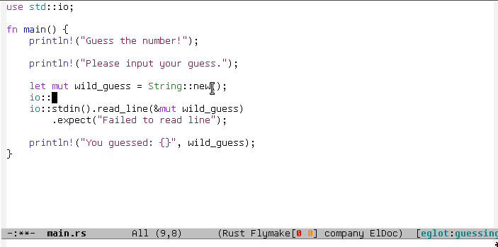
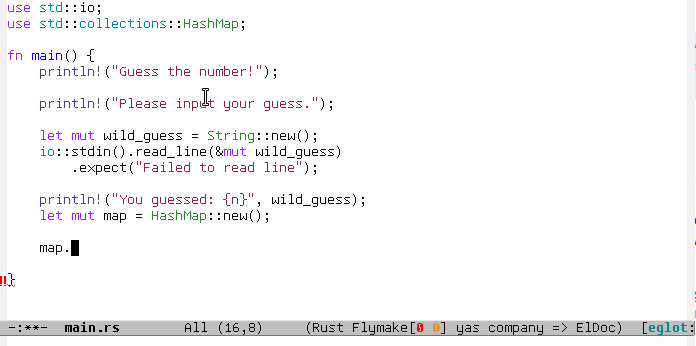
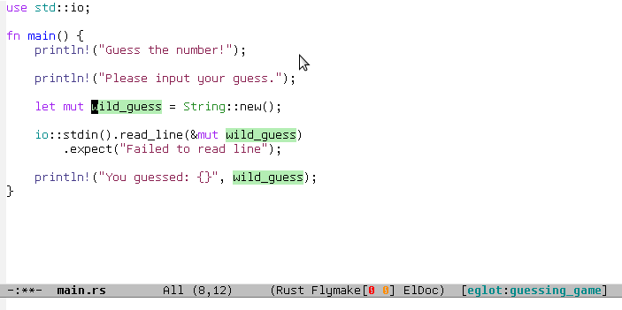
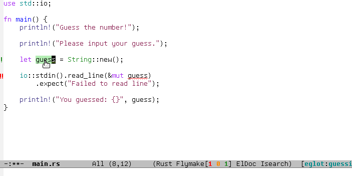
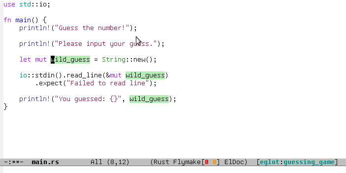
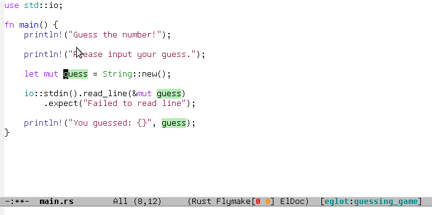
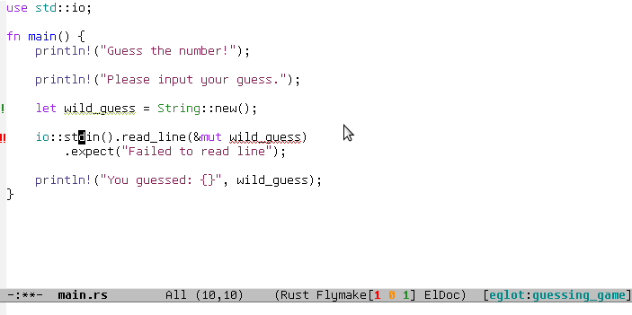
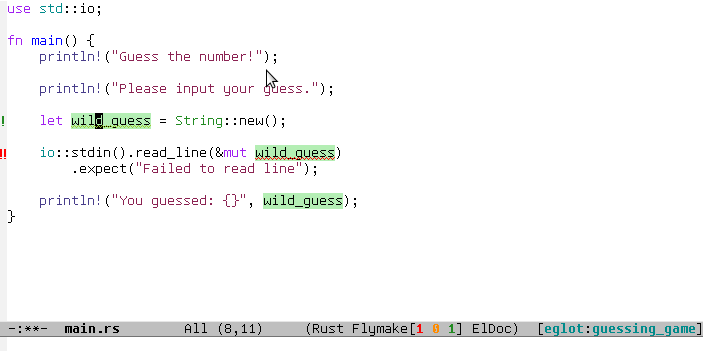

[](https://travis-ci.org/joaotavora/eglot)
[](http://melpa.org/#/eglot)

# M-x Eglot

*E*macs Poly*glot*: an Emacs [LSP][lsp] client that stays out of your
way:

* 📽 Scroll down this README for some [pretty gifs](#animated_gifs)
* 📚 Read about [servers](#connecting), [commands and
  keybindings](#commands), and [customization](#customization)
* 📣 Read the [NEWS][news] file

# _1-2-3_

Install from [ELPA][gnuelpa] or [MELPA][melpa].  Just type `M-x
package-install RET eglot RET` into Emacs 26.1+.

Now find some source file, any source file, and type `M-x eglot`.

*That's it*. If you're lucky, this guesses the LSP program to start
for the language you're using. Otherwise, it prompts you to enter one.

<a name="connecting"></a>
# Connecting to a server

`M-x eglot` can guess and work out-of-the-box with these servers:

* Javascript's [javascript-typescript-stdio][javascript-typescript-langserver]
* Rust's [rls][rls]
* Python's [pyls][pyls]
* Ruby's [solargraph][solargraph]
* Java's [Eclipse JDT Language Server][eclipse-jdt]
* Bash's [bash-language-server][bash-language-server]
* PHP's [php-language-server][php-language-server]
* C/C++'s [ccls][ccls]  ([cquery][cquery] and [clangd][clangd] also work)
* Haskell's [IDE engine][haskell-ide-engine]
* Elm's [elm-language-server][elm-language-server]
* Kotlin's [kotlin-language-server][kotlin-language-server]
* Go's [gopls][gopls]
* Ocaml's [ocaml-language-server][ocaml-language-server]
* R's [languageserver][r-languageserver]
* Dart's [dart_language_server][dart_language_server]
* Elixir's [elixir-ls][elixir-ls]
* Ada's [ada_language_server][ada_language_server]
* Scala's [metals][metals]
* TeX/LaTeX's [Digestif][digestif]

I'll add to this list as I test more servers. In the meantime you can
customize `eglot-server-programs`:

```lisp
(add-to-list 'eglot-server-programs '(foo-mode . ("foo-language-server" "--args")))
```

Let me know how well it works and we can add it to the list.  

To skip the guess and always be prompted use `C-u M-x eglot`.

## Connecting automatically

You can also do:

```lisp
  (add-hook 'foo-mode-hook 'eglot-ensure)
```

, to attempt to start an eglot session automatically everytime a
`foo-mode` buffer is visited.

## Connecting via TCP

The examples above use a "pipe" to talk to the server, which works
fine on Linux and OSX but in some cases
[*may not work on Windows*][windows-subprocess-hang].

To circumvent this limitation, or if the server doesn't like pipes,
you can use `C-u M-x eglot` and give it `server:port` pattern to
connect to a previously started TCP server serving LSP information.

If you don't want to start it manually every time, you can configure
Eglot to start it and immediately connect to it.  Ruby's
[solargraph][solargraph] server already works this way out-of-the-box.

For another example, suppose you also wanted start Python's `pyls`
this way:

```lisp
(add-to-list 'eglot-server-programs
             `(python-mode . ("pyls" "-v" "--tcp" "--host"
                              "localhost" "--port" :autoport)))
```

You can see that the element associated with `python-mode` is now a
more complicated invocation of the `pyls` program, which requests that
it be started as a server.  Notice the `:autoport` symbol in there: it
is replaced dynamically by a local port believed to be vacant, so that
the ensuing TCP connection finds a listening server.

## Per-project server configuration

Most servers can guess good defaults and will operate nicely
out-of-the-box, but some need to be configured specially via LSP
interfaces.  Additionally, in some situations, you may also want a
particular server to operate differently across different projects.

Per-project settings are realized with Emacs's _directory variables_
and the Elisp variable `eglot-workspace-configuration`.  To make a
particular Python project always enable Pyls's snippet support, put a
file named `.dir-locals.el` in the project's root:

```lisp
((python-mode
  . ((eglot-workspace-configuration
      . ((:pyls . (:plugins (:jedi_completion (:include_params t)))))))))
```

This tells Emacs that any `python-mode` buffers in that directory
should have a particular buffer-local value of
`eglot-workspace-configuration`.  That variable's value should be
_association list_ of _parameter sections_ which are presumably
understood by the server.  In this example, we associate section
`pyls` with the parameters object `(:plugins (:jedi_completion
(:include_params t)))`.

Now, supposing that you also had some Go code in the very same
project, you can configure the Gopls server in the same file.  Adding
a section for `go-mode`, the file's contents become:

```lisp
((python-mode
  . ((eglot-workspace-configuration
      . ((:pyls . (:plugins (:jedi_completion (:include_params t))))))))
 (go-mode
  . ((eglot-workspace-configuration
      . ((:gopls . (:usePlaceholders t)))))))
```

If you can't afford an actual `.dir-locals.el` file, or if managing
these files becomes cumbersome, the Emacs manual teaches you
programmatic ways to leverage per-directory local variables.

## Handling quirky servers

Some servers need even more special hand-holding to operate correctly.
If your server has some quirk or non-conformity, it's possible to
extend Eglot via Elisp to adapt to it.  Here's an example on how to
get [cquery][cquery] working:

```lisp
(add-to-list 'eglot-server-programs '((c++ mode c-mode) . (eglot-cquery "cquery")))

(defclass eglot-cquery (eglot-lsp-server) ()
  :documentation "A custom class for cquery's C/C++ langserver.")

(cl-defmethod eglot-initialization-options ((server eglot-cquery))
  "Passes through required cquery initialization options"
  (let* ((root (car (project-roots (eglot--project server))))
         (cache (expand-file-name ".cquery_cached_index/" root)))
    (list :cacheDirectory (file-name-as-directory cache)
          :progressReportFrequencyMs -1)))
```

See `eglot.el`'s section on Java's JDT server for an even more
sophisticated example.

<a name="reporting bugs"></a>
# Reporting bugs

Having trouble connecting to a server?  Expected to have a certain
capability supported by it (e.g. completion) but nothing happens?  Or
do you get spurious and annoying errors in an otherwise smooth
operation?  We may have help, so open a [new
issue](https://github.com/joaotavora/eglot/issues) and try to be as
precise and objective about the problem as you can:

1. Try to replicate the problem with **as clean an Emacs run as
   possible**.  This means an empty `.emacs` init file or close to it
   (just loading `eglot.el`, `company.el` and `yasnippet.el` for
   example, and you don't even need `use-package.el` to do that).
    
2. Include the log of **LSP events** and the **stderr output** of the
   server (if any).  You can find the former with `M-x
   eglot-events-buffer` and the latter with `M-x eglot-stderr-buffer`.
   You run these commands in the buffer where you enabled Eglot, but
   if you didn't manage to enable Eglot at all (because of some
   bootstrapping problem), you can still find these buffers in your
   buffer list: they're named like `*EGLOT <project>/<major-mode>
   events*` and `*EGLOT <project>/<major-mode> stderr*`.
    
3. If Emacs errored (you saw -- and possibly heard -- an error
   message), make sure you repeat the process using `M-x
   toggle-debug-on-error` so you **get a backtrace** of the error that
   you should also attach to the bug report.
   
Some more notes: it's understandable that you report it to Eglot
first, because that's the user-facing side of the LSP experience in
Emacs, but the outcome may well be that you will have to report the
problem to the server's developers, as is often the case.  But the
problem can very well be on Eglot's side, of course, and in that case
we want to fix it!  Also bear in mind that Eglot's developers have
limited resources and no way to test all the possible server
combinations, so you'll have to do most of the testing.

<a name="commands"></a>
# Commands and keybindings

Here's a summary of available commands:

- `M-x eglot`, as described above;

- `M-x eglot-reconnect` reconnects to the server;

- `M-x eglot-shutdown` says bye-bye to the server;

- `M-x eglot-rename` ask the server to rename the symbol at point;

- `M-x eglot-format` asks the server to format buffer or the active
  region;

- `M-x eglot-code-actions` asks the server for any code actions at
  point. These may tipically be simple fixes, like deleting an unused
  variable, or fixing an import. Left click on diagnostics to check if
  there are any there;

- `M-x eglot-help-at-point` asks the server for help for symbol at
  point.

- `M-x eglot-events-buffer` jumps to the events buffer for debugging
  communication with the server.

- `M-x eglot-stderr-buffer` if the LSP server is printing useful debug
information in stderr, jumps to a buffer with these contents.

- `M-x eglot-signal-didChangeConfiguration` updates the LSP server
configuration according to the value of the variable
`eglot-workspace-configuration`, which you may be set in a
`.dir-locals` file, for example.

There are *no keybindings* specific to Eglot, but you can bind stuff
in `eglot-mode-map`, which is active as long as Eglot is managing a
file in your project. The commands don't need to be Eglot-specific,
either:

```
(define-key eglot-mode-map (kbd "C-c h") 'eglot-help-at-point)
(define-key eglot-mode-map (kbd "<f6>") 'xref-find-definitions)
```

<a name="customization"></a>
# Customization

Here's a quick summary of the customization options.  In Eglot's
customization group (`M-x customize-group`) there is more
documentation on what these do.

- `eglot-autoreconnect`: Control ability to reconnect automatically to
  the LSP server;

- `eglot-connect-timeout`: Number of seconds before timing out LSP
  connection attempts;

- `eglot-sync-connect`: Control blocking of LSP connection attempts;

- `eglot-events-buffer-size`: Control the size of the Eglot events
  buffer;

- `eglot-ignored-server-capabilites`: LSP server capabilities that
  Eglot could use, but won't;

- `eglot-put-doc-in-help-buffer`: If non-nil, put eldoc docstrings in
  separate `*eglot-help*` buffer;

- `eglot-auto-display-help-buffer`: If non-nil, automatically display
  `*eglot-help*` buffer;

- `eglot-confirm-server-initiated-edits`: If non-nil, ask for confirmation 
  before allowing server to edit the source buffer's text;

There are a couple more variables that you can customize via Emacs
lisp:

- `eglot-server-programs`: as described [above](#connecting);

- `eglot-strict-mode`: Set to `nil` by default, meaning Eglot is
  generally lenient about non-conforming servers.  Set this to
  `(disallow-non-standard-keys enforce-required-keys)` when debugging
  servers.

- `eglot-server-initialized-hook`: Hook run after server is
  successfully initialized;

- `eglot-managed-mode-hook`: Hook run after Eglot started or stopped
  managing a buffer.  Use `eglot-managed-p` to tell if current buffer
  is still being managed.

# How does Eglot work?

`M-x eglot` starts a server via a shell-command guessed from
`eglot-server-programs`, using the current major-mode (for whatever
language you're programming in) as a hint.

If the connection is successful, you see an `[eglot:<server>]`
indicator pop up in your mode-line.  More importantly, this means
current *and future* file buffers of that major mode *inside your
current project* automatically become \"managed\" by the LSP server,
This means that information about these file's contents is exchanged
periodically to provide enhanced code analysis.  Among other features:

* definitions can be found via `xref-find-definitions`;
* on-the-fly diagnostics are given by `flymake-mode`;
* function signature hints are given by `eldoc-mode`;
* completion can be summoned with `completion-at-point`.

Some extra features are provided if certain libraries are installed
and enabled, such as:

* completion dropdowns via [company];
* snippet completions via [yasnippet];
* marked-up documentation via [markdown].

Eglot doesn't _require_ these libraries to work effectively, but will
use them automatically if they are found to be active.

To "unmanage" a project's buffers, shutdown the server with `M-x
eglot-shutdown`.

# Supported Protocol features

## General
- [x] initialize
- [x] initalized
- [x] shutdown
- [x] exit
- [ ] $/cancelRequest

## Window
- [x] window/showMessage
- [x] window/showMessageRequest
- [x] window/logMessage
- [x] telemetry/event

## Client
- [x] client/registerCapability (but only
  `workspace/didChangeWatchedFiles`, like RLS asks)
- [x] client/unregisterCapability  (ditto)

## Workspace
- [ ] workspace/workspaceFolders (3.6.0)
- [ ] workspace/didChangeWorkspaceFolders (3.6.0)
- [x] workspace/didChangeConfiguration
- [x] workspace/configuration (3.6.0)
- [x] workspace/didChangeWatchedFiles
- [x] workspace/symbol
- [x] workspace/executeCommand
- [x] workspace/applyEdit

## Text Synchronization
- [x] textDocument/didOpen
- [x] textDocument/didChange (incremental or full)
- [x] textDocument/willSave
- [x] textDocument/willSaveWaitUntil
- [x] textDocument/didSave
- [x] textDocument/didClose

## Diagnostics
- [x] textDocument/publishDiagnostics

## Language features
- [x] textDocument/completion
- [x] completionItem/resolve (works quite well with [company-mode][company-mode])
- [x] textDocument/hover
- [x] textDocument/signatureHelp (fancy stuff with Python's [pyls][pyls])
- [x] textDocument/definition
- [x] textDocument/typeDefinition (3.6.0)
- [x] textDocument/implementation (3.6.0)
- [x] textDocument/declaration (3.14)
- [x] textDocument/references
- [x] textDocument/documentHighlight
- [x] textDocument/documentSymbol
- [x] textDocument/codeAction
- [ ] textDocument/codeLens
- [ ] codeLens/resolve
- [ ] textDocument/documentLink
- [ ] documentLink/resolve
- [ ] textDocument/documentColor
- [ ] textDocument/colorPresentation (3.6.0)
- [x] textDocument/formatting 
- [x] textDocument/rangeFormatting
- [ ] textDocument/onTypeFormatting
- [x] textDocument/rename

<a name="animated_gifs"></a>
# _Obligatory animated gif section_

## Completion


The animation shows [company-mode][company] presenting the completion
candidates to the user, but Eglot works with the built-in
`completion-at-point` function as well, which is usually bound to
`C-M-i`.

## Snippet completion


Eglot provides template based completion if the server supports
snippet completion and [yasnippet][yasnippet] is enabled _before_
Eglot connects to the server.  The animation shows
[company-mode][company], but `completion-at-point` also works with
snippets.

## Diagnostics


Eglot relays the diagnostics information received from the server to
[flymake][flymake].  Command `display-local-help` (bound to `C-h .`)
shows the diagnostic message under point, but flymake provides other
convenient ways to handle diagnostic errors.

When Eglot manages a buffer, it disables other flymake backends.  See
variable `eglot-stay-out-of` to change that.

## Code Actions


The server may provide code actions, for example, to fix a diagnostic
error or to suggest refactoring edits.  Command `eglot-code-actions`
queries the server for possible code actions at point.  See variable
`eglot-confirm-server-initiated-edits` to customize its behavior.

## Hover on symbol


## Rename


Type `M-x eglot-rename RET` to rename the symbol at point.

## Find definition


To jump to the definition of a symbol, use the built-in
`xref-find-definitions` command, which is bound to `M-.`.

## Find references


Eglot here relies on emacs' built-in functionality as well.
`xref-find-references` is bound to `M-?`.  Additionally, Eglot
provides the following similar commands: `eglot-find-declaration`,
`eglot-find-implementation`, `eglot-find-typeDefinition`.

# Historical differences to lsp-mode.el

Around May 2018, I wrote a comparison of Eglot to `lsp-mode.el`, and
was discussed with its then-maintainer.  That mode has since been
refactored/rewritten and now
[purports to support](https://github.com/joaotavora/eglot/issues/180)
a lot of features that differentiated Eglot from it.  It may now be
very different or very similar to Eglot, or even sing with the birds
in the trees, so [go check it out][emacs-lsp].  That said, here's the
original comparison, which I will not be updating any more.

"Eglot is considerably less code and hassle than lsp-mode.el.  In most
cases, there's nothing to configure.  It's a minimalist approach
focused on user experience and performance.

User-visible differences:

- The single most visible difference is the friendly entry point `M-x
  eglot`, not `M-x eglot-<language>`.  Also, there are no
  `eglot-<language>` extra packages.

- There's no "whitelisting" or "blacklisting" directories to
  languages.  `M-x eglot` starts servers to handle file of a major
  mode inside a specific project, using Emacs's built-in `project.el`
  library to discover projects.  Then it automatically detects current
  and future opened files under that project and syncs with server;

- Easy way to quit/restart a server, just middle/right click on the
  connection name;
- Pretty interactive mode-line section for live tracking of server
  communication;
- Automatically restarts frequently crashing servers (like RLS);
- Slow-to-start servers start asynchronously in the background;
- Server-initiated edits are confirmed with the user;
- Diagnostics work out-of-the-box (no `flycheck.el` needed);
- Smoother/more responsive (read below).
   
Under the hood:

- Message parser is much simpler.
- Defers signature requests like `textDocument/hover` until server is
  ready.
- Sends `textDocument/didChange` for groups of edits, not
  one per each tiny change.
- Easier to read and maintain elisp. Yeah I know, *very subjective*,
  so judge for yourself.
- Doesn't *require* anything other than Emacs, but will automatically
  upgrade to work with stuff outside Emacs, like `company`,
  `markdown-mode`, if you happen to have these installed.
- Has automated tests that check against actual LSP servers."

[lsp]: https://microsoft.github.io/language-server-protocol/
[rls]: https://github.com/rust-lang-nursery/rls
[pyls]: https://github.com/palantir/python-language-server
[gnuelpa]: https://elpa.gnu.org/packages/eglot.html
[melpa]: http://melpa.org/#/eglot
[javascript-typescript-langserver]: https://github.com/sourcegraph/javascript-typescript-langserver
[emacs-lsp]: https://github.com/emacs-lsp/lsp-mode
[emacs-lsp-plugins]: https://github.com/emacs-lsp
[bash-language-server]: https://github.com/mads-hartmann/bash-language-server
[php-language-server]: https://github.com/felixfbecker/php-language-server
[company-mode]: https://github.com/company-mode/company-mode
[cquery]: https://github.com/cquery-project/cquery
[ccls]: https://github.com/MaskRay/ccls
[clangd]: https://clang.llvm.org/extra/clangd.html
[solargraph]: https://github.com/castwide/solargraph
[windows-subprocess-hang]: https://www.gnu.org/software/emacs/manual/html_node/efaq-w32/Subprocess-hang.html
[haskell-ide-engine]: https://github.com/haskell/haskell-ide-engine
[elm-language-server]: https://github.com/elm-tooling/elm-language-server
[kotlin-language-server]: https://github.com/fwcd/KotlinLanguageServer
[gopls]: https://github.com/golang/go/wiki/gopls
[eclipse-jdt]: https://github.com/eclipse/eclipse.jdt.ls
[ocaml-language-server]: https://github.com/freebroccolo/ocaml-language-server
[r-languageserver]: https://cran.r-project.org/package=languageserver
[dart_language_server]: https://github.com/natebosch/dart_language_server
[elixir-ls]: https://github.com/JakeBecker/elixir-ls
[news]: https://github.com/joaotavora/eglot/blob/master/NEWS.md
[ada_language_server]: https://github.com/AdaCore/ada_language_server
[metals]: http://scalameta.org/metals/
[digestif]: https://github.com/astoff/digestif
[company]: http://elpa.gnu.org/packages/company.html
[flymake]: https://www.gnu.org/software/emacs/manual/html_node/flymake/index.html#Top
[yasnippet]: http://elpa.gnu.org/packages/yasnippet.html
[markdown]: https://github.com/defunkt/markdown-mode
